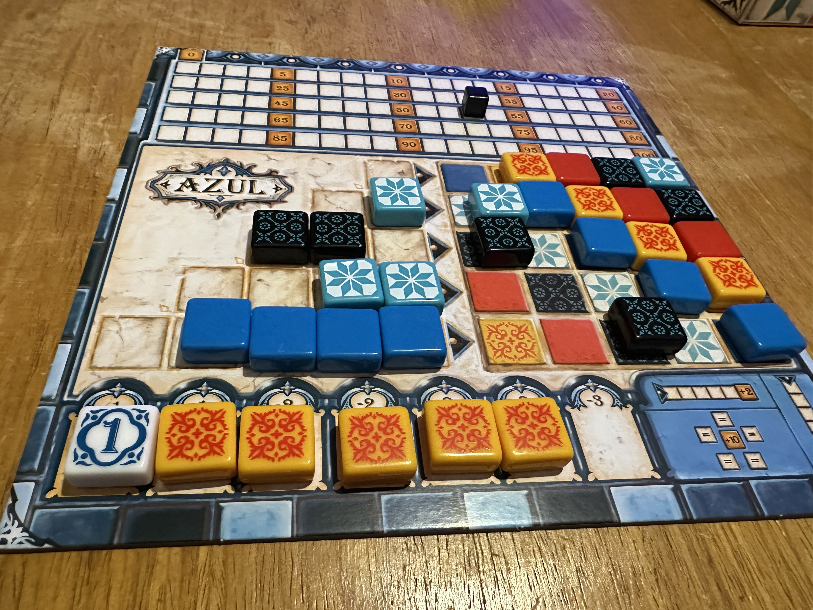
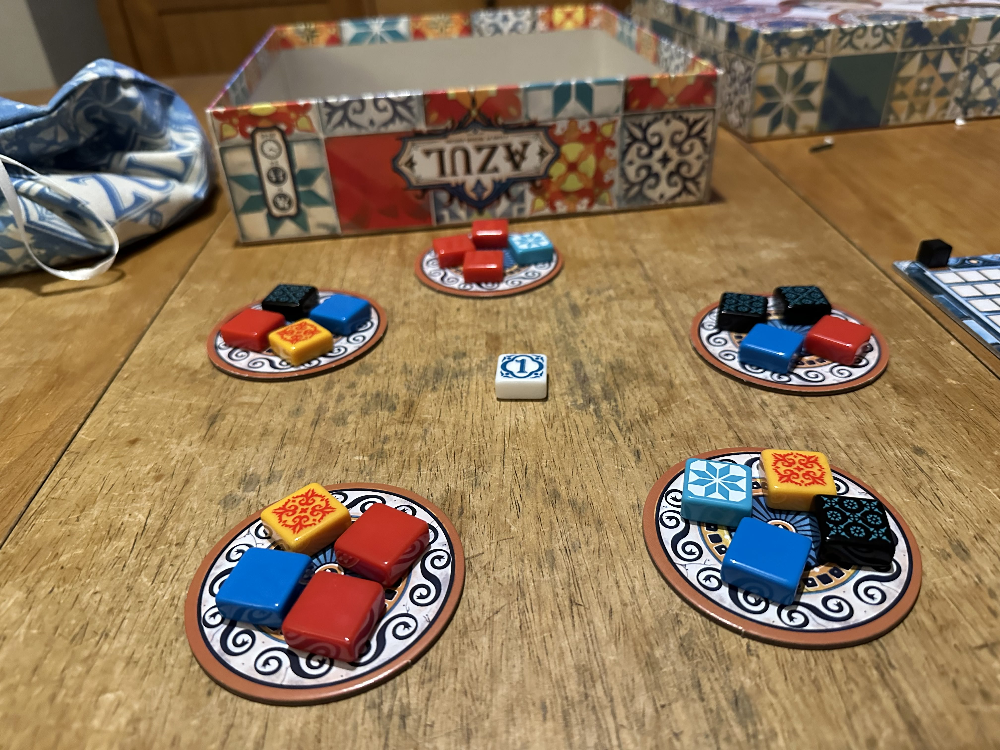

# Azul API

## Pre-Requisites

- `Python 3.12` is required to run this application. You can find information on how to install this specific version [here](https://docs.python.org/3/using/windows.html).

- `pip3` is required to install dependencies for the application. It usually comes bundled with `Python 3`.

- `Visual Studio Code` is the text editor I used to build this application. Feel free to use the text editor of your choice. You can install `VS Code` [here](https://code.visualstudio.com/download).

## Setting Up

- Open `VS Code`, and under `File`, select `Open Folder...`.

- Select `Azul API` from the file explorer.

- Open a new `Terminal` under `Terminal` > `New Terminal`.

- Navigate to the `Azul API` directory in the terminal, and then run the following command:

```
pip3 install numpy
```

- Now that the dependencies are installed, you can go ahead and run the application. In the terminal, run the following command:

```
python3 gameplay.py
```

This will run a script that uses the `Game` library to simulate a game between 2 players. Please note that the script is by no means a work of art, and honestly plays the game quite badly. So the players will most probably end up with horrible scores.

But the purpose of this script is to demonstrate how to use the `Game` library to set up the `players` and `factories`, and play the game. Feel free to play around with the script or create a new one.

I hope you enjoy playing this game as much as I enjoyed building it!

## Bonus Content

In preparation for this assignment, I purchased the `Azul` board game online.

Here are some images of me playing the game with my partner:

There's me losing horribly.



And my partner sneakily winning away, humbling me to my **core**.


And here's the factories!



Anyway, just wanted to conclude this by saying that this was an incredibly exciting journey, and you've made a fan for life! :)
